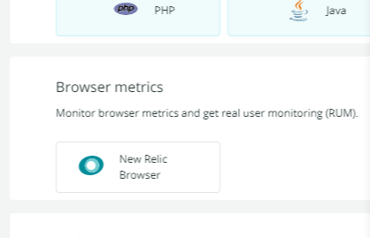
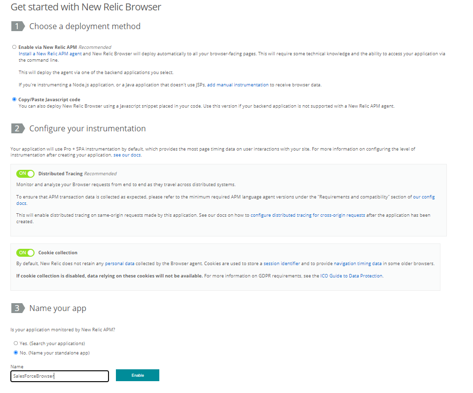
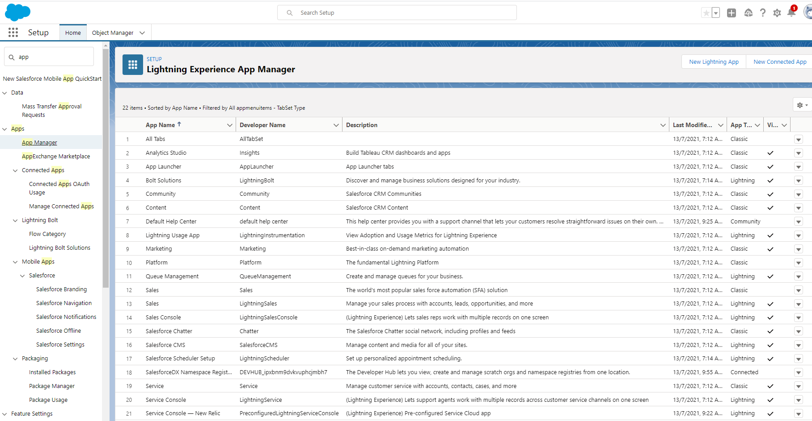
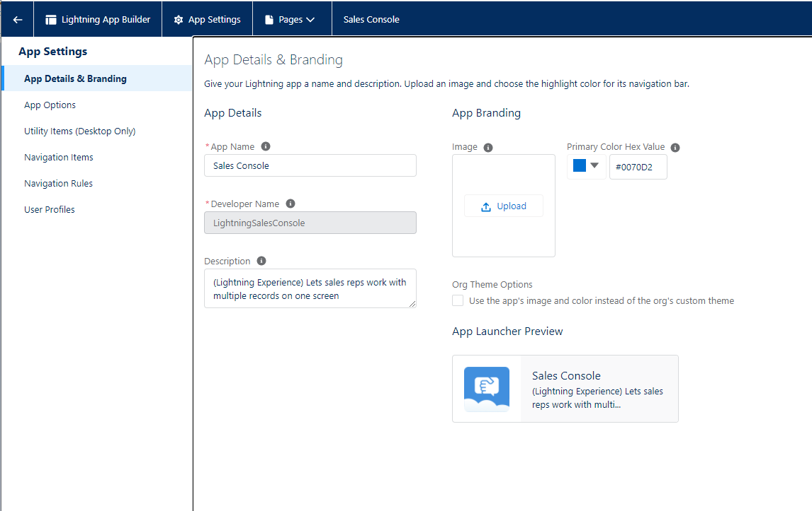
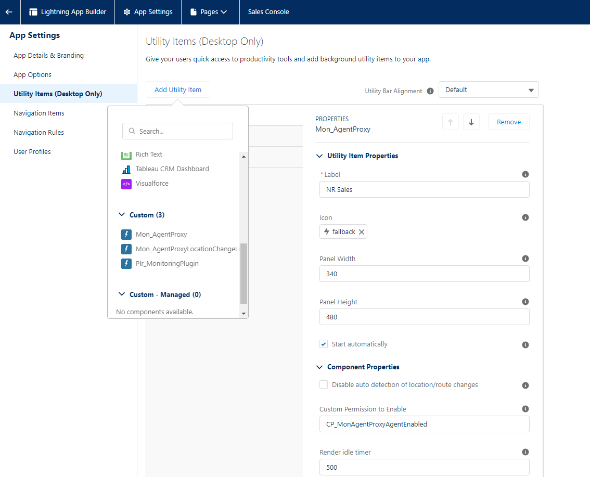
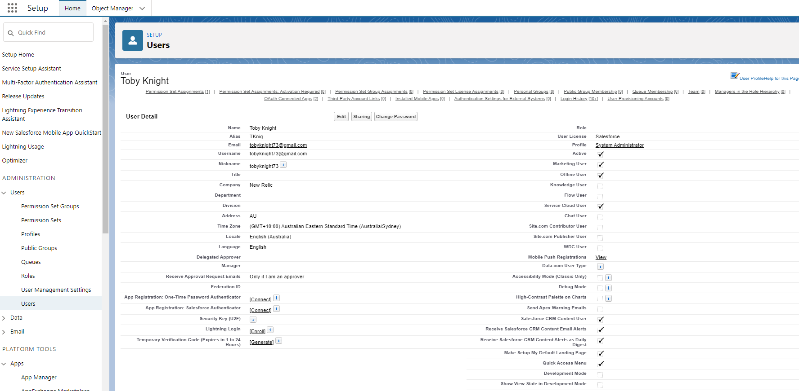
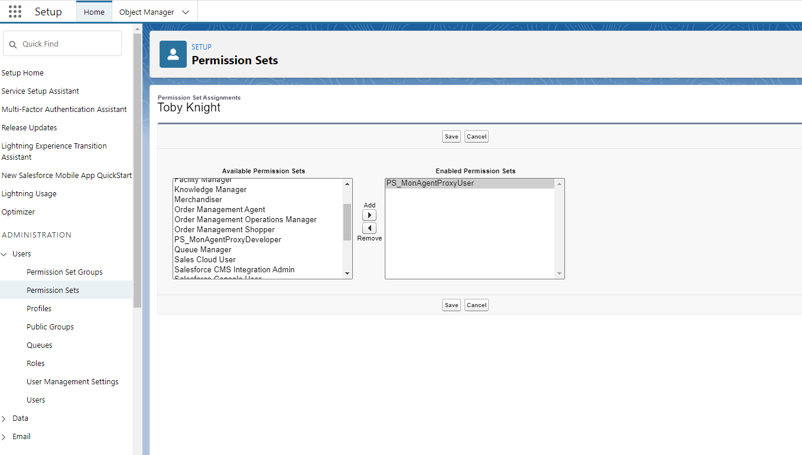
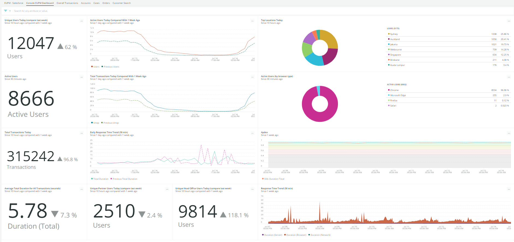

[](https://opensource.newrelic.com/oss-category/#new-relic-experimental)

# Salesforce Lightning Browser

> This project was created to build Real User Monitoring into Salesforce Lightning web pages. It leverages the New Relic Browser framework to ingest data. By using this Salesforce control you can gain insights into how your Salesforce front end is performaing in real time. 
## Installation

 - Download repo
 - Ensure you access to a Salesforce Environment. You can create a [Salesforce Developer Environment](https://developer.salesforce.com/signup) for testing. 
 - Open your New Relic account and `Click on Add More Data`, select New Relic Browser

    <p align="center">
        
    </p>

 - Select, `Copy/Paste Javascript code` and provide a `name` for your app, Click enable

    <p align="center">
        
    </p>


 - Copy the Javascript Snippet
 - Open `\force-app\main\default\staticresources\mon_primary_snippet.js` and copy the JavaScript snippet
 - Remove the first `"<script type="text/javascript">"` and last `"</script>"`lines from the snippet. Save mon_primary_snippet.js
 - Open `\force-app\main\default\staticresources\mon_secondary_snippet.js` and copy the JavaScript snippet
 - Remove the first `"<script type="text/javascript">"` and last `"</script>"` lines from the snippet. Save mon_secondary_snippet.js
 - Download and install the [Salesforce CLI](https://developer.salesforce.com/tools/sfdxcli)
 - Open a terminal/command session an change directory to the root of the project
 - Run `sfdx --version` to ensure the Salesforce CLI is correctly installed
 - Create a profile and authenticate to your Salesforce environment:
```bash
    sfdx force:auth:web:login -d -a MySalesForceDev-r https://newrelic-e-dev-ed.my.salesforce.com/
```     
 - Deploy the New Relic Browser Salesforce Component to your Salesforce environment
```bash
      sfdx force:source:deploy -x package.xml -u MySalesForceDev
```

 - Log in to your Salesforce Environment and select Settings 
    <p align="center">
        
    </p>

 - In the `Quick Find` search box type `App` and select `App Manager`

    <p align="center">
        
    </p>

 - Select the App you wish to add the New Relic Browser monitor to, in this example,  `Sales Console` select `Edit`

 - Select `Utilty Items (Desktop Only)` from the left navigation area

    <p align="center">
        
    </p>


 - Select `Add Utility`, Scroll down to `Mon_AgentProxy`

   <p align="center">
        
    </p>


 - In the `Label Field` give the monitor a name `NR Sales`

 - Select the `Start Automatically` Checkbox and Select `Save`

 - Navigate back to `Setup` and Select `Users`, and select the User to add the Browser montioring to


   <p align="center">
        
    </p>


 - Select `Permission Set Assignments` and Select `Edit Assigments` for `Permission Set Assignments`

   <p align="center">
        
    </p>


 - Select `PS_MonAgentProxyUser` and Select `Save`

 - Open the `Sales Console` App, at the bottom on the `Utility Bar` there will be a `NR Sales` Component. 

 - Installation  is complete

## Usage

- Once installed data will flow to NR via the Browser Interaction Event, you can create Dashboards as per below

   <p align="center">
        
    </p>

## Support

New Relic has open-sourced this project. This project is provided AS-IS WITHOUT WARRANTY OR DEDICATED SUPPORT. Issues and contributions should be reported to the project here on GitHub.


>We encourage you to bring your experiences and questions to the [Explorers Hub](https://discuss.newrelic.com) where our community members collaborate on solutions and new ideas.

## Contributing

We encourage your contributions to improve Salesforce Lightning Browser! Keep in mind when you submit your pull request, you'll need to sign the CLA via the click-through using CLA-Assistant. You only have to sign the CLA one time per project. If you have any questions, or to execute our corporate CLA, required if your contribution is on behalf of a company, please drop us an email at opensource@newrelic.com.

**A note about vulnerabilities**

As noted in our [security policy](../../security/policy), New Relic is committed to the privacy and security of our customers and their data. We believe that providing coordinated disclosure by security researchers and engaging with the security community are important means to achieve our security goals.

If you believe you have found a security vulnerability in this project or any of New Relic's products or websites, we welcome and greatly appreciate you reporting it to New Relic through [HackerOne](https://hackerone.com/newrelic).

## License

Salesforce Lightning Browser is licensed under the [Apache 2.0](http://apache.org/licenses/LICENSE-2.0.txt) License.
